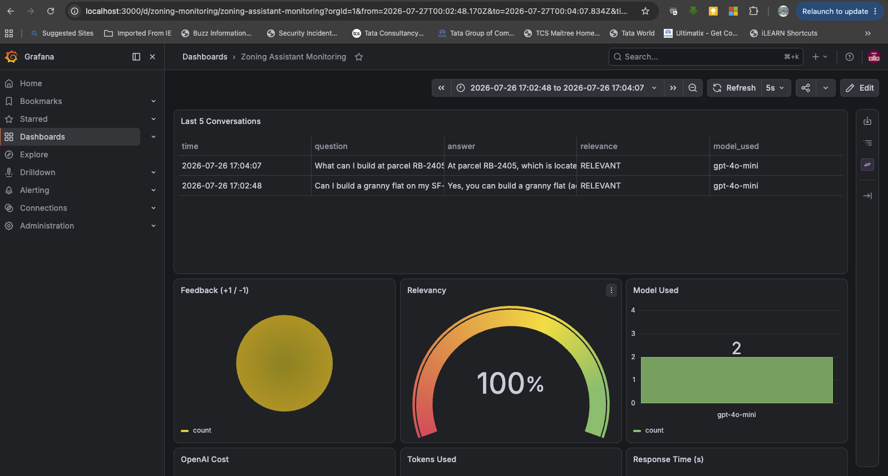
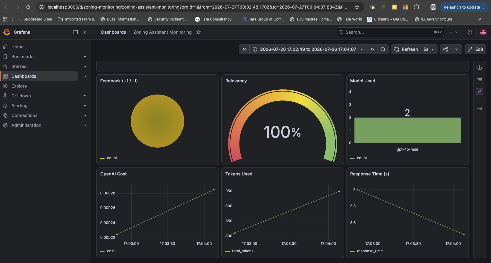

# Property & Zoning Research Assistant

An AI assistant that answers natural-language questions about **what can
legally be built on a property** — ADUs, setbacks, height limits, lot
coverage, permits, flood-zone rules — grounded in a municipal zoning code,
with citations back to the source section.

> "Can I build a granny flat on my SF-2 lot?"
> "Do I need a permit before pouring a foundation?"
> "What's the maximum height in the GR district next to houses?"

Answering these today means manually cross-referencing dense zoning codes,
property records, and permit rules — slow, error-prone, and requiring
domain expertise most people don't have. A wrong assumption can mean a
rejected permit or a costly redesign. This project puts a RAG system in
front of that knowledge base so anyone can ask in plain English and get an
answer **with the section number that backs it up**.

## Evaluation Criteria Checklist

| Criteria | Where to look |
|---|---|
| Problem description | This section, above |
| Retrieval flow | [`zoning_assistant/rag.py`](zoning_assistant/rag.py) |
| Retrieval evaluation | [`notebooks/retrieval-eval.ipynb`](notebooks/retrieval-eval.ipynb) |
| LLM evaluation | [`notebooks/rag-eval.ipynb`](notebooks/rag-eval.ipynb) |
| Interface | Flask API + CLI, see "Running it" below |
| Ingestion pipeline | [`zoning_assistant/ingest.py`](zoning_assistant/ingest.py), runs automatically at startup |
| Monitoring | Grafana dashboard (screenshot below) + feedback via `/feedback` |
| Containerization | [`docker-compose.yaml`](docker-compose.yaml) — app, Postgres, Grafana all included |
| Reproducibility | "Running it" section; all versions pinned in `Pipfile.lock` |

This is the capstone project for [LLM Zoomcamp](https://github.com/DataTalksClub/llm-zoomcamp).

**Also in this repo:**
- [`DEMO.md`](DEMO.md) — how the system is put together, component by component, plus a scripted 10-minute demo to run for a grader or interviewer.

## How it works

Plain retrieve-then-answer RAG (deliberately no agent/tool-calling — see
[Design decisions](#design-decisions)):

```
User question ──▶ Flask API ──▶ minsearch (keyword retrieval, tuned boosts)
                                      │
                                      ▼
                          top-5 zoning sections (+ parcel record
                          if the question mentions a known address/ID)
                                      │
                                      ▼
                     LLM with a grounding prompt: answer only from
                     retrieved sections, cite section numbers,
                     say "I don't know" otherwise
                                      │
                                      ▼
                Answer + citations ──▶ logged to Postgres ──▶ Grafana
```

## Dataset

The knowledge base is a **synthetic but realistic zoning code for the
fictional "City of Riverbend"**, modeled on the structure of Austin, TX's
Land Development Code (district naming like SF-1/SF-3/MF-2/GR/CS, rule
categories, Article/Section numbering):

- [`data/zoning.csv`](data/zoning.csv) — **59 zoning rules**, one row per
  code section: `id, section, district, category, title, text`. Covers
  lot standards, setbacks, height, lot coverage/FAR, ADUs, permits,
  variances, floodplain, historic overlays, trees, parking, short-term
  rentals, fences, signs, stormwater, density bonuses.
- [`data/parcels.csv`](data/parcels.csv) — **40 parcels** with address,
  zoning district, lot size, flood zone, historic overlay, year built.
  If a question mentions a known parcel ID or address, its record is
  injected into the prompt so the answer is parcel-specific.
- [`data/ground-truth-retrieval.csv`](data/ground-truth-retrieval.csv) —
  **295 evaluation questions** (~5 per rule), including synonym-heavy
  phrasings ("granny flat" for ADU, etc.).

Why synthetic: the repo is fully self-contained and reproducible with
zero download steps, and doesn't ship a stale snapshot of a real
municipal code. Swapping in a real city (Municode / open-data portal)
only requires producing a CSV with the same columns —
`data/generate_seed_data.py` documents the generation.

## Tech stack

- Python 3.12, [minsearch](https://github.com/alexeygrigorev/minsearch)
  (vendored, in-memory keyword search — no vector DB by design)
- OpenAI API (`gpt-4o-mini` by default, configurable)
- Flask API + CLI, Postgres (conversation/feedback logging),
  Grafana (auto-provisioned dashboard), Docker Compose
- Pipenv for dependency management

## Running it

### 1. Configure

```bash
cp .env.example .env
# edit .env and set OPENAI_API_KEY
```

By default the app listens on port 5000. On macOS, this can collide with
AirPlay Receiver (Control Center), which also uses port 5000 — if
`docker compose up` fails with "address already in use," change
`APP_PORT` in `.env` to something else (e.g. `5050`) and re-run.

### 2. Start everything

```bash
docker compose up -d --build
```

This starts the Flask app (port 5000 by default), Postgres (5432), and
Grafana (3000, admin/admin, dashboard auto-provisioned).

### 3. Initialize the database (first run only)

```bash
pipenv install --dev
pipenv run python db_prep.py
```

### 4. Ask questions

Via the API:

```bash
curl -X POST http://localhost:5000/question \
  -H "Content-Type: application/json" \
  -d '{"question": "Can I build a granny flat on my SF-2 lot?"}'
```

Send feedback (use the `conversation_id` from the response):

```bash
curl -X POST http://localhost:5000/feedback \
  -H "Content-Type: application/json" \
  -d '{"conversation_id": "<id>", "feedback": 1}'
```

Or interactively via the CLI:

```bash
pipenv run python cli.py            # type your own questions
pipenv run python cli.py --random   # sample from the ground-truth set
```

### Running locally without Docker (app only)

```bash
pipenv install --dev
export POSTGRES_HOST=localhost
pipenv run python app.py
```

## Evaluation

### Retrieval evaluation

Notebook: [`notebooks/retrieval-eval.ipynb`](notebooks/retrieval-eval.ipynb).
295 ground-truth questions, split 100 validation / 195 test. Metrics:
**Hit Rate** (correct section anywhere in top-k) and **MRR** (rank-
weighted). Boost weights tuned by random search (30 iterations) on the
validation split, optimizing MRR; reported on the held-out test split:

| Configuration | Hit Rate (test) | MRR (test) |
|---|---|---|
| Baseline — no boosts, k=5 | 73.3% | 0.526 |
| **Tuned boosts, k=5** | **76.4%** | **0.561** |

Tuned weights: `section=0.66, district=1.52, category=0.08, title=0.60,
text=1.95` — the rule body text and the district name matter most; the
category label adds almost nothing once the text is weighted properly.

**Documented limitation (the bridge to semantic search):** on
synonym-phrased ADU questions ("granny flat", "backyard cottage", ...)
hit rate drops to **~41%** vs 76% overall — a measured paraphrase gap,
which is why the next project adds pgvector/semantic search.

Ground-truth generation: [`notebooks/evaluation-data-generation.ipynb`](notebooks/evaluation-data-generation.ipynb)
(LLM-generated questions). The committed CSV was produced by the offline
template-based generator (`data/generate_ground_truth_offline.py`) so the
evaluation is reproducible with no API key.

### RAG (answer) evaluation

Notebook: [`notebooks/rag-eval.ipynb`](notebooks/rag-eval.ipynb).
LLM-as-judge with a 3-way label scheme on a 200-question sample:

- `RELEVANT` / `PARTLY_RELEVANT` / `NON_RELEVANT`

compared across two answering models (`gpt-4o-mini` vs `gpt-4o`) to
justify the final model choice. Categorical labels are used instead of a
numeric score because they're more reproducible across judge calls and
map to a clear decision (ship / review / reject). Judge labels are
hand-spot-checked to catch systematic bias, such as the judge rewarding
longer answers regardless of correctness.

Grounding matters more than fluency in this domain: **a hallucinated
zoning rule has real legal and financial consequences**. The answer
prompt requires section citations and an explicit "I don't know" when the
retrieved context doesn't cover the question, and every production answer
is also judged and logged (see Monitoring).

## Monitoring

Every query is logged to Postgres (`conversations` + `feedback` tables):
question, answer, judged relevance + explanation, model, tokens, cost,
response time, and thumbs up/down.

The Grafana dashboard is **auto-provisioned** at startup
(`grafana/provisioning/`) with 7 panels:

1. **Last 5 conversations** (table)
2. **Feedback** +1/-1 (pie chart)
3. **Relevancy** (gauge, thresholded from LLM-as-judge labels)
4. **Model used** (bar chart)
5. **OpenAI cost** (time series)
6. **Tokens used** (time series)
7. **Response time** (time series)




To see the dashboard with data without spending API credits:

```bash
pipenv run python generate_data.py   # inserts a synthetic conversation/second
```

Then open http://localhost:3000 (admin/admin) → "Zoning Assistant
Monitoring".

## Design decisions

| Decision | Choice | Why |
|---|---|---|
| Retrieval | minsearch (keyword, in-memory) | Proves the evaluation methodology with zero infra risk; its measured synonym gap (41% vs 76%) makes the case for semantic search later |
| Chunking | One record per zoning section (structure-based, not fixed-token) | Zoning code has strong native structure; "Section 3.2" is a defensible citation, "chunk 17" is not |
| Agent | None — plain RAG | Single-hop retrieve-then-answer doesn't need tool-calling; multi-source questions (parcel lookup + geocoding + code) are the documented gap that motivates an agentic version in a later project |
| Interface | Flask + CLI | Synchronous flow — async frameworks would be premature at this scope |
| Ingestion | At app startup | minsearch is in-memory; scheduled pipelines belong to the roadmap, not this scope |

## Project structure

```
├── app.py                     # Flask API (/question, /feedback)
├── cli.py                     # interactive CLI (with --random mode)
├── db_prep.py                 # initialize Postgres schema
├── generate_data.py           # synthetic monitoring data for Grafana
├── zoning_assistant/
│   ├── rag.py                 # search + prompt + LLM + judge + cost
│   ├── ingest.py               # load CSVs into minsearch at startup
│   ├── db.py                  # Postgres logging
│   └── minsearch.py           # vendored in-memory search
├── data/
│   ├── zoning.csv              # knowledge base (59 sections)
│   ├── parcels.csv             # 40 parcel records
│   ├── ground-truth-retrieval.csv
│   ├── generate_seed_data.py
│   └── generate_ground_truth_offline.py
├── notebooks/
│   ├── retrieval-eval.ipynb
│   ├── rag-eval.ipynb
│   └── evaluation-data-generation.ipynb
├── grafana/provisioning/      # datasource + 7-panel dashboard
├── docs/screenshots/           # README images
├── Dockerfile
├── docker-compose.yaml
├── Pipfile
└── .env.example
```

## Reproducibility notes

- All data is committed; regenerate with the scripts in `data/` if desired.
- Dependencies are version-pinned in the `Pipfile`, and `Pipfile.lock` is
  committed for exact dependency pinning.
- Evaluation is fully offline (no API key needed) up to and including
  retrieval tuning; only ground-truth *regeneration* and the RAG/judge
  evaluation call the OpenAI API.

## Disclaimer

Research assistance, not legal advice. The bundled zoning code is
synthetic. Final determinations on any real project are made by the
relevant city's planning department.
